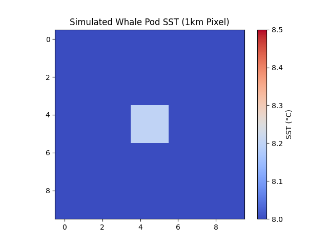
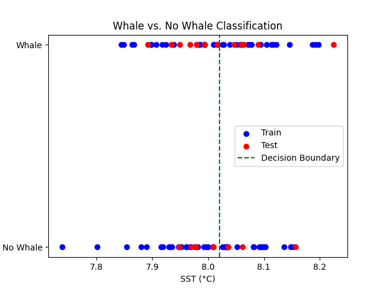

# Whale-Strike-Tracker
Tracking whales with satellite ML to prevent ship strikes in the Norwegian Sea.

## Overview
Uses NOAA SST and ML to detect whale pods, laying groundwork for ship rerouting or sensor alerts.

- **Data**: NOAA AVHRR SST (1km), simulated whale anomalies  
- **Model**: Random Forest Classifier (Accuracy: ~0.90)  
- **Goal**: Save whales (e.g., fin, humpback) from cargo collisions—PhD concept  

## Results
- Whale SST: ~8.04°C (0.2°C anomaly)  
- No Whale SST: ~8.00°C  
  

## Setup
1. `pip install -r requirements.txt`
2. Authenticate GEE: `earthengine authenticate`
3. Run `whale_data.py` then `whale_classifier.py`

## Next Steps
- Add Sentinel-2 imagery (10m)  
- Integrate AIS ship data  
- Prototype acoustic dispersal sensors  